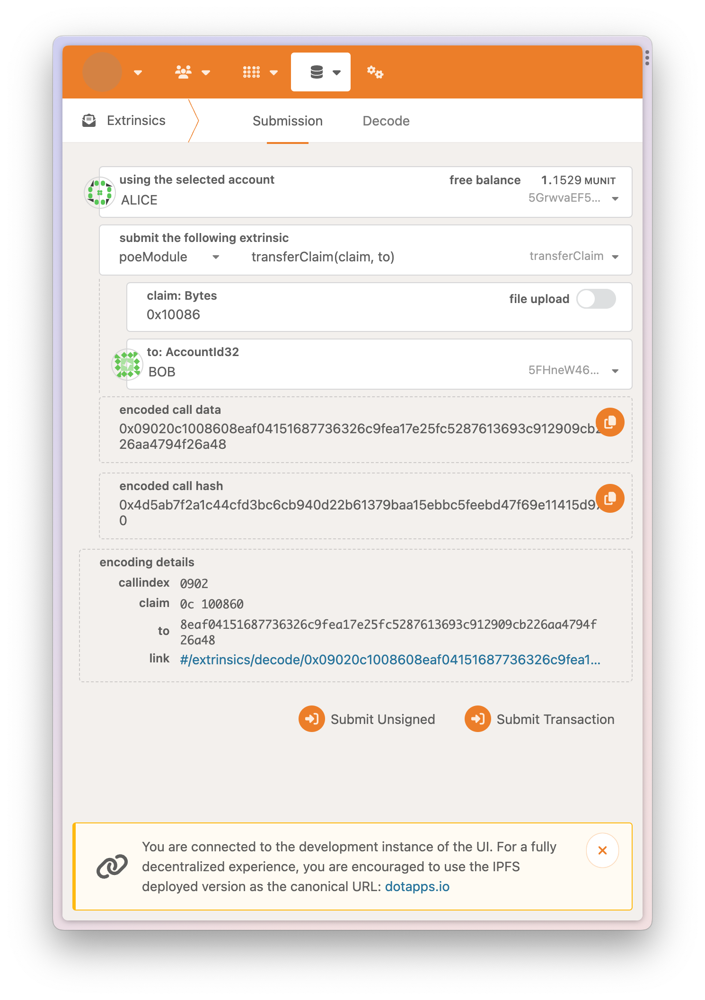

# POE

## Account

## task 1 create and revoked claim, screen snapshots

- run node template
 
  
  
- creat claim
 
  
  
- revoke claim
 
  
  
- check claim state
 
  

## task 2 trans claim, screen snapshots

- alice creat claim
 
  
  
- check claim state, the claim belong to alice
 
  
  
- alice trans claim to bob, we saw the claim state is changed
 
  
  
- check claim state, the claim belong to bob
 
  