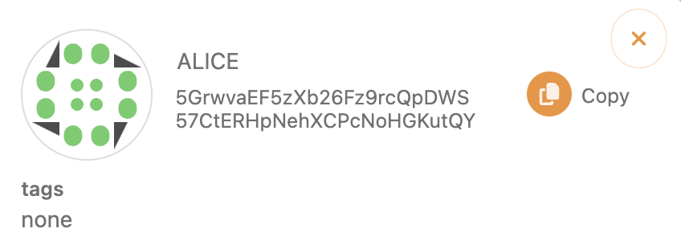
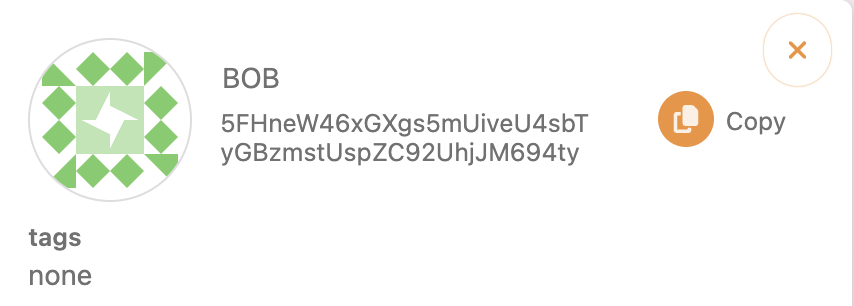
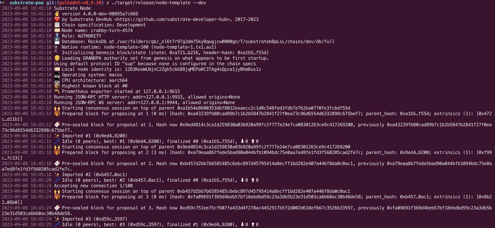
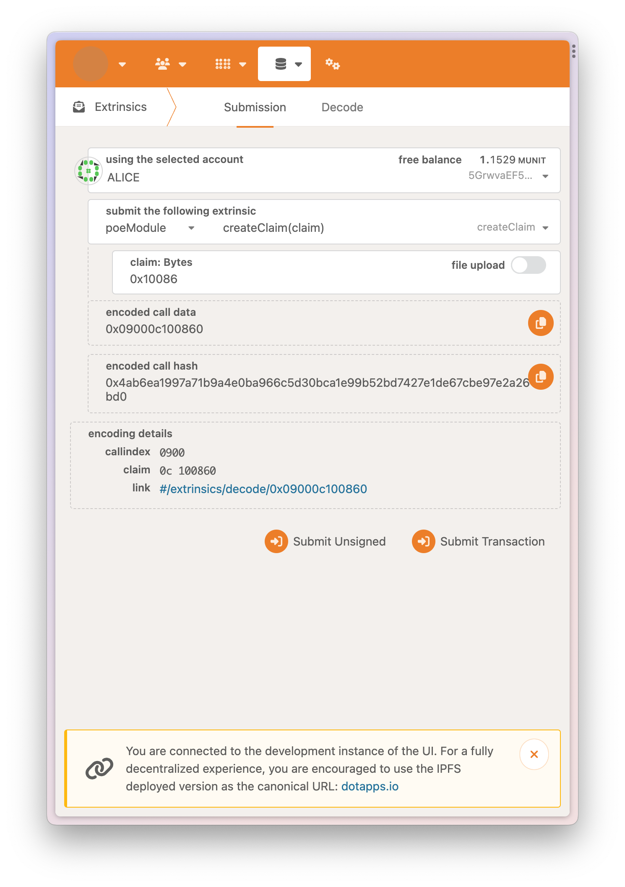
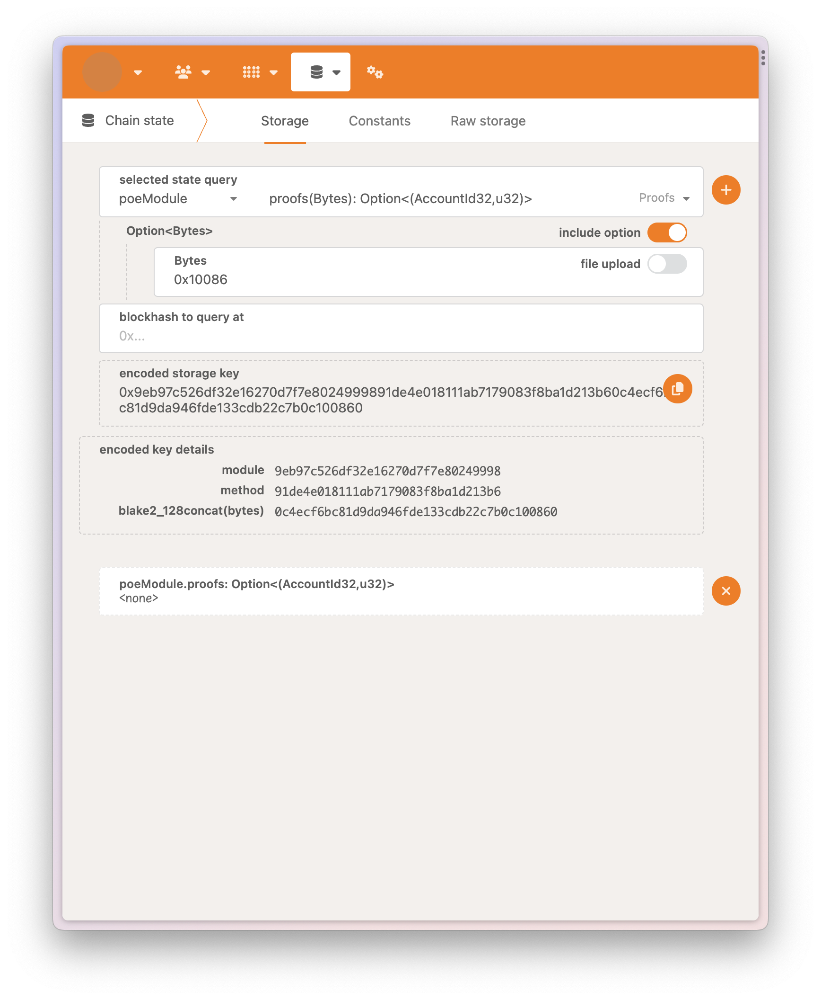
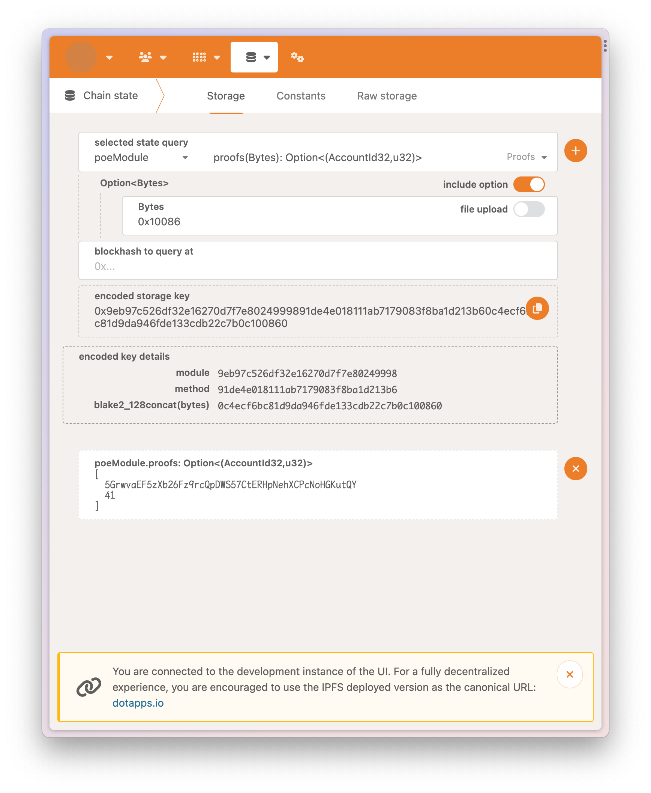
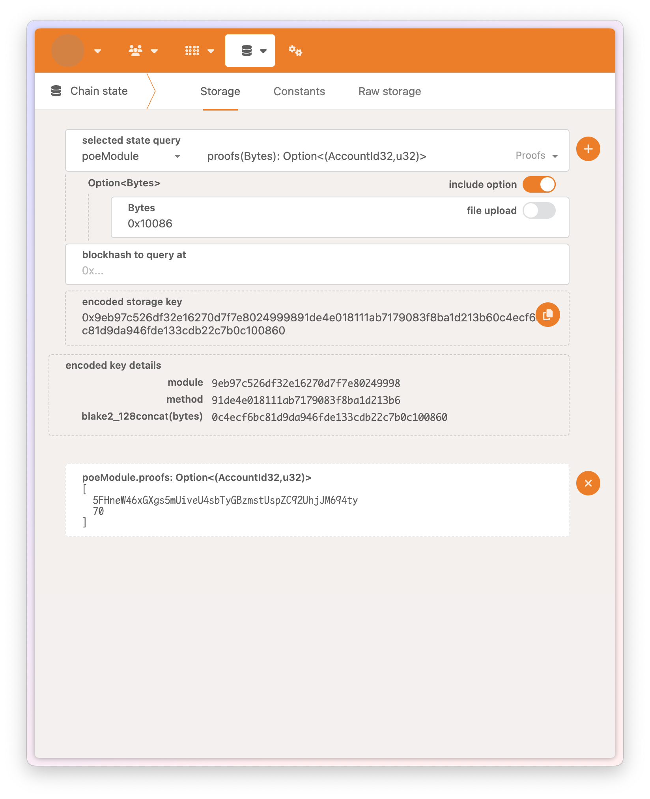

# POE

## Account

## task 1 create and revoked claim, screen snapshots

- run node template
  
- creat claim
  
- revoke claim
  
- check claim state
  

## task 2 trans claim, screen snapshots
- alice creat claim
  
- check alice claim state
  
- alice trans claim to bob, we saw the claim state is changed
  